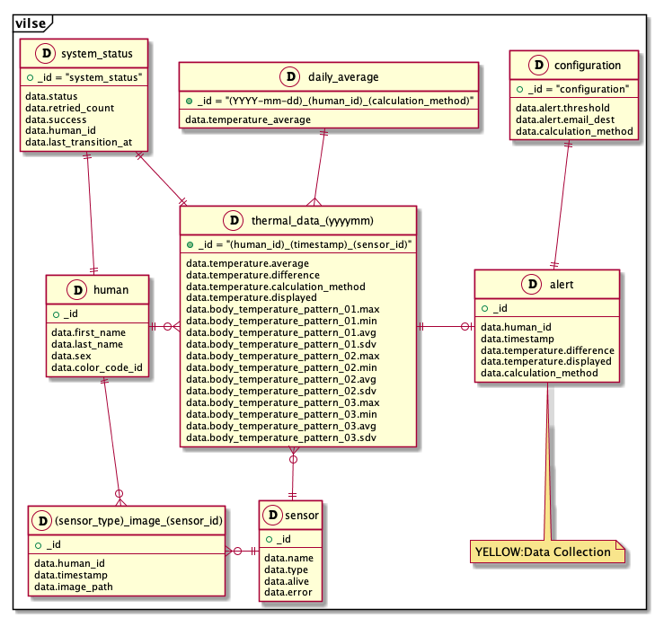

# Dodai resources

## Entity Relationships



## Dedicated data collections

### human

There is one `human` data collection.

```json
{
  "_id": "5a4594adb536252100afc0e5",
  "data": {
    "first_name": "太郎",
    "last_name": "被験",
    "sex": "male",
    "color_code_id": "3",
  }
}
```

- `_id` is generated by dodai automatically.
- `data.first_name` and `data.last_name` is the name of measured person.
- `data.sex` is sex of measured person.
  -  There are three types of value: `male`, `female` and `unknown`.
- `color_code_id` is unique and created incrementally by `1`.

### `sensor` data collection

There is one `sensor` data collection.

```json
{
  "_id": "5a45d96cb53625210024c1d4",
  "data": {
    "name": "AX8",
    "type": "thermal",
    "alive": false,
    "error": "異常が起きました"
  }
}
```

- `_id` is generated by dodai automatically.
- `data.name` is the name of the sensor.
- `data.type` is either `thermal` or `colorcode`.
- `data.alive` express if the sensor is alive.
- `data.error` is the details when the sensor is abnormal.

### `(sensor_type)_image_(sensor_id)` data collection

Every `(sensor_type)_image_(sensor_id)` data collection is created when any `sensor` data entity created.

```json
{
  "_id": "5af53b6336000036000d64d5",
  "data": {
    "human_id": "5a4594adb536252100afc0e5",
    "timestamp": "2017-01-05T00:00:00+00:00",
    "image_path": "/optional_camera/5a4594adb536252100afc0e5_1483574400.png",
  }
}
```

- `_id` is generated by dodai automatically.
- `data.human_id` is the `_id` of measured person.
- `data.timestamp` is the time of image delivered to Edge.
- `data.image_path` is the image's path stored in Edge.

### `thermal_data_(yyyymm)` data collection

Each `thermal_data_(yyyymm)` data collection is created either when any `sensor` data entity (whose `data.type` is `thermal`) created or by AsyncJob.

```json
{
  "_id": "5a4594adb536252100afc0e5_1547533064124_5a45d96cb53625210024c1d4",
  "data": {
    "temperature": {
      "average": 36.3,
      "difference": 0.3,
      "calculation_method": "max",
      "displayed": 36.6
    },
    "body_temperature_pattern_01": {
      "max": 36.6,
      "min": 35.2,
      "avg": 36.1,
      "sdv": 36.0
    },
    "body_temperature_pattern_02": {
      "max": 36.6,
      "min": 34.8,
      "avg": 36.0,
      "sdv": 36.2
    },
    "body_temperature_pattern_03": {
      "max": 36.4,
      "min": 36.1,
      "avg": 36.2,
      "sdv": 36.3
    }
  }
}
```

- `_id` is of the format `(human_id)_(timestamp)_(sensor_id)`.
- `data.temperature.average` is the average temperature over the past month.
- `data.temperature.difference` is the difference between `average` and `displayed`.
- `data.temperature.calculation_method` is the method used for calculation.
  - The value belongs to one of the following options: `max`, `min`, `avg` or `sdv`.
- `data.temperature.displayed` is the temperature gonna be displayed.
- `data.body_temperature_pattern_01`, `data.body_temperature_pattern_02` and `data.body_temperature_pattern_03` differs from the measuring area.
- `data.body_temperature_pattern_xx`
  - `.max` is the max temperature measured in the pattern.
  - `.min` is the min temperature measured in the pattern.
  - `.avg` is the average temperature measured in the pattern.
  - `.sdv` is the standard deviation of all temperature measured in the pattern.

### `daily_average` data collection

There is one `daily_average` data collection.

```json
{
  "_id": "2017-01-05_5a4594adb536252100afc0e5_max",
  "data": {
    "temperature_average": 36.3
  }
}
```

- `_id` is of the form `(YYYY-mm-dd)_(human_id)_(calculation_method)`
- `data.temperature_average` is the average temperature of the day.

### `alert` data collection

There is one `alert` data collection.

```json
{
  "_id": "5af53b6236000036000d64d4",
  "data": {
    "human_id": "5a4594adb536252100afc0e5",
    "timestamp": "2017-01-05T00:00:00+00:00",
    "temperature_difference": 0.3,
    "temperature_displayed": 36.6,
    "calculation_method": "max"
  }
}
```

- `_id` is generated by dodai automatically.
- `data.human_id` is the `_id` of measured person.
- `data.timestamp` is the time of data delivered to Edge.
- `data.temperature_difference` is the difference between `temperature_average` and `temperature_displayed`.
- `data.calculation_method` is the method used for calculation.
  - The value belongs to one of the following options: `max`, `min`, `avg` or `sdv`.

### `configuration` data collection

There is one `configuration` data collection.

```json
{
  "_id": "configuration",
  "data": {
    "alert_threshold": 2.3,
    "alert_email_dest": ["taro.kanri@vilse.com"],
    "calculation_method": "max"
  }
}
```

- `_id` is set to be `"configuration"`.
  - We only have one data entity in `configuration` collection for now.
- `data.alert_threshold` is threshold for the data.
  - If temperature difference exceeds the threshold, the alert will be created.
- `data.alert_email_dest` is an email address list for receiving alert.
- `data.calculation_method` is the method used of calculation for measuring temperature.
  - The value belongs to one of the following options: `max`, `min`, `avg` or `sdv`.

### `system_status` data collection

There is one `system_status` data collection.

```json
{
  "_id": "system_status",
  "data": {
    "status": "idle",
    "retried_count": 0,
    "success": false,
    "human_id": "5a4594adb536252100afc0e5",
    "last_transition_at": 1486304940000
  }
}
```

- `_id` is set to be `"system_status"`.
  - We only have one data entity in `system_status` collection for now.
- `data.status` is status of the measuring system.
  - The value belongs to one of the following options: `idle`, `measuring_temperature_with_color_code`, `measuring_temperature_by_manual`, `presenting_temperature_with_color_code` or `presenting_temperature_by_manual`.
- `data.retried_count` is the number of retrying.
  - The value will increase when failing to detect face.
  - The minimum is `0` and the maximum is according to the threshold set in gear_config.
  - If `data.status` is `idle`, the value is fixed to be `0`.
  - If `data.status` is `measuring_temperature_with_color_code` or `measuring_temperature_by_manual`, the value could be from `0` to the maximum.
    - When the face is detected successfully before exceeding maximum, `status` will be set to `presenting_temperature_with_color_code` or `presenting_temperature_by_manual`, and `success` is `true`.
    - When the value reaches the maximum but failing to detect face, `status` will be set to `presenting_temperature_with_color_code` or `presenting_temperature_by_manual`, and `success` is `false`.
  - If `data.status` is `presenting_temperature_with_color_code` or `presenting_temperature_by_manual`, the value means the number of retrying for transferring from `measuring_xxx` to `presenting_xxx`.
- `data.success` is the result of the measurement.
- `data.human_id` is the `_id` of measured person.
- `data.last_transition_at` is the timestamp for the time when updating status.
